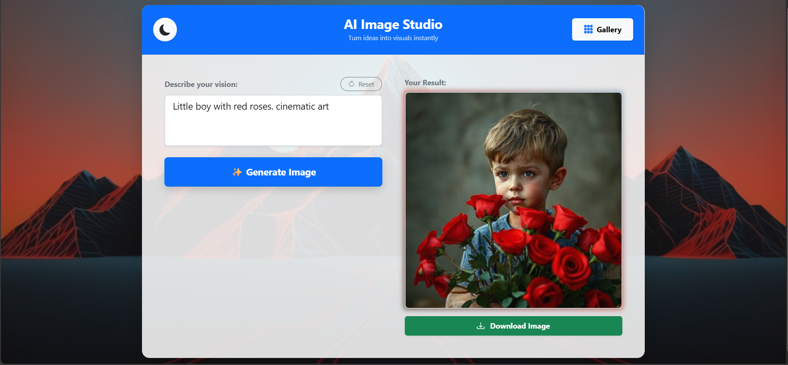
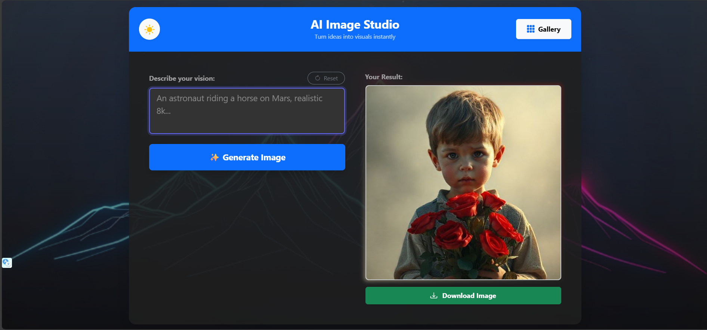

# 🎨 AI Image Studio

> A professional, full-stack AI Image Generator that creates stunning visuals from text prompts. Free, unlimited, and packed with advanced UI features.


---
Visit official site:[AI Image Studio](https://ai-image-studio-lake.vercel.app/)

## 🚀 Overview

**AI Image Studio** is a web application that allows users to generate high-quality AI art instantly. Unlike standard wrappers, this project features a **custom Node.js backend** to handle requests securely and a **React frontend** polished with modern animations, glassmorphism, and persistent state management.

It uses the **Pollinations.ai API** to provide unlimited generations without requiring users to pay for API keys.

## ✨ Key Features

* **⚡ Free & Unlimited:** Generates images instantly without paid subscriptions or API keys.
* **🌗 Light & Dark Mode:** Fully themed UI with smooth transitions and custom background wallpapers.
* **🎨 Dynamic Color Extraction:** The image border glows and changes color based on the dominant colors of the generated art (using `colorthief`).
* **📂 Persistent Gallery:** Automatically saves your prompt history and seeds to Local Storage, so your gallery survives page refreshes.
* **📱 Smart Sidebar:** A slide-out history panel that lets you revisit and re-download past creations.
* **📥 One-Click Download:** Bypasses CORS restrictions to allow direct high-resolution image downloads.
* **✨ Fluid Animations:** Features page load slides, flash-reset effects, and hover transitions for a premium feel.

## 🛠️ Tech Stack

**Frontend:**
*  **React.js (Vite)**
*  **Bootstrap 5** & **Custom CSS**
* **ColorThief** (for dynamic border colors)

**Backend:**
*  **Node.js**
*  **Express.js**

**API:**
* **Pollinations.ai** (Open Source AI Model)

---

## 📸 Screenshots

| Light Mode ☀️ | Dark Mode 🌙 |
| :---: | :---: |
|  |  |

---

## ⚙️ Installation & Setup

This project uses a **Client-Server** architecture. You need to run both terminals.

### 1. Clone the Repository
```bash
git clone [https://github.com/your-username/ai-image-studio.git](https://github.com/your-username/ai-image-studio.git)
cd ai-image-studio
```
### 2. Setup Backend (Server)
```bash
cd server
npm install
npm start
```
### The server will start on http://localhost:8080
### 3. Setup Frontend (Client)
### Open a new terminal and navigate to the project folder:
```bash
cd client
npm install
npm run dev
```
### The app will start on http://localhost:5173
---

## 🤝 Contributing
### Contributions are welcome! Feel free to open issues or submit pull requests.

### Fork the Project

#### Create your Feature Branch (git checkout -b feature/AmazingFeature)

#### Commit your Changes (git commit -m 'Add some AmazingFeature')

#### Push to the Branch (git push origin feature/AmazingFeature)

#### Open a Pull Request
---
## 📄 License

Distributed under the MIT License. See `LICENSE` for more information.
